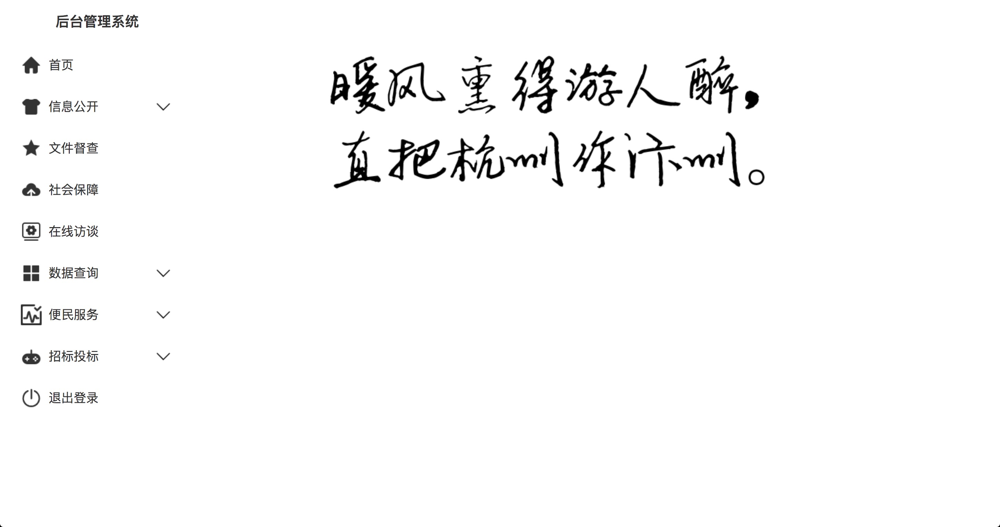
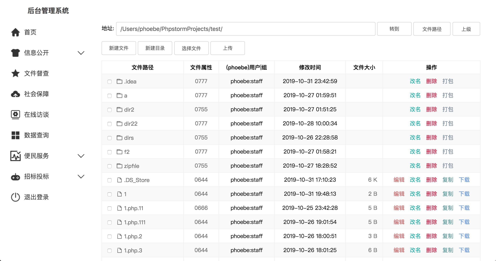
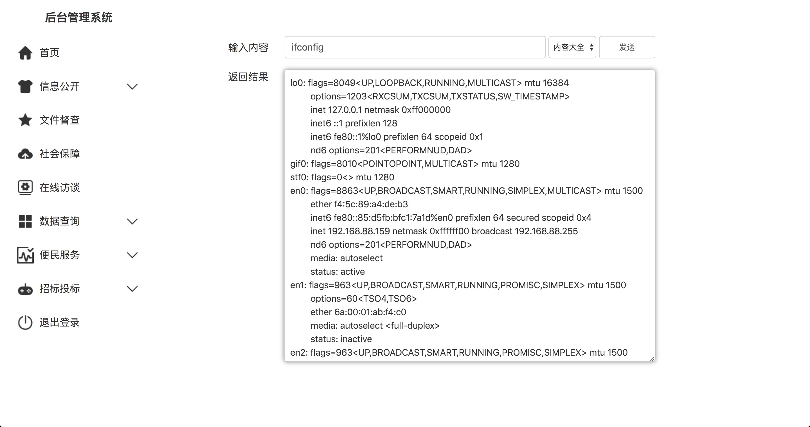
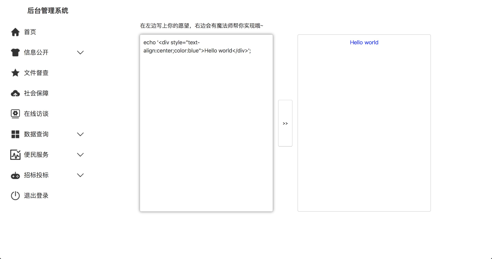
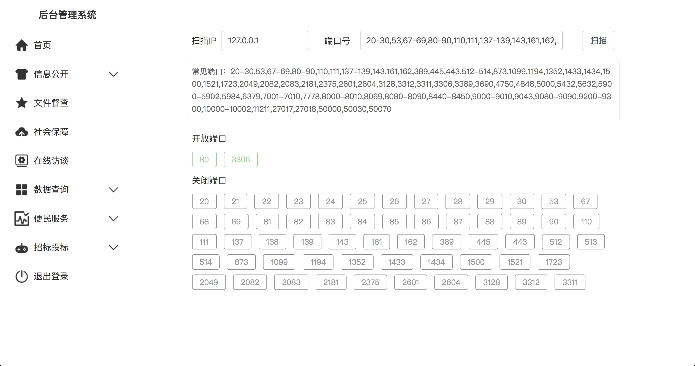
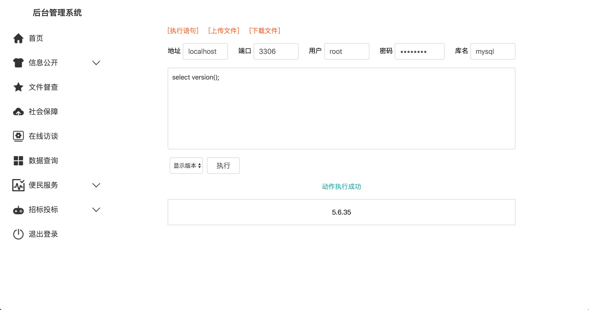
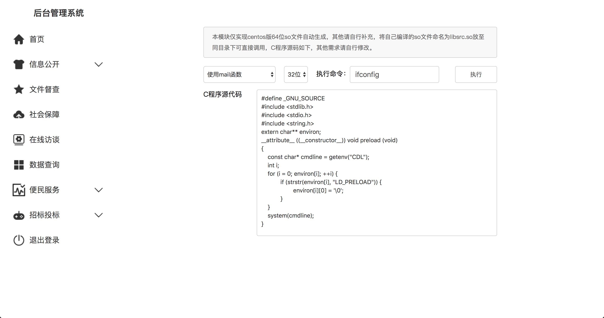
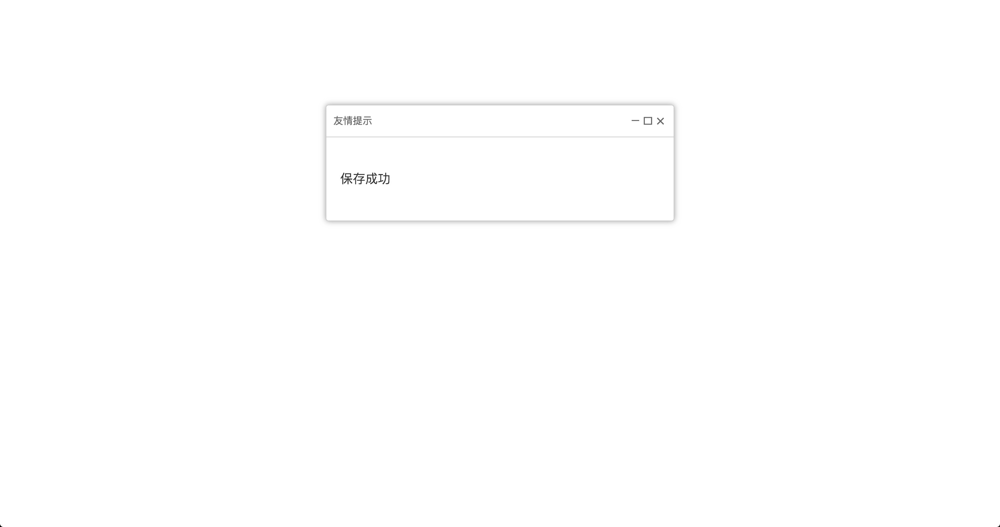

# 有中国特色的PHP后台管理系统

一个娱乐向 PHP 单页面后台管理系统。我将其命名为：Stitch。

## 简介

学了几天PHP，写了个后台管理系统，实现了单文件对服务器、数据库的管理，前前后后花了大概两周半的时间。第一次也是最后一次写PHP，难免写出各种问题漏洞，随便看看就行，别太认真。

## 功能

本后台管理系统提供了管理员常用的功能：PHPINFO、系统信息、文件操作、代码执行、命令执行、数据库执行、反弹提权，查找文件、端口扫描、远程文件下载等功能，并集成了socket 代理，可直接用管理系统访问内网，集成了LD_PRELOAD 绕过 disable_functions ，支持命令实时回显网页，并支持蚁剑、菜刀等管理端连接。

## 思路

就那些思路

## 设计

本 PHP 后台管理系统采用了极简主义风格设计，页面简约大方，布局清晰有条理，包括了常见的图标、样式，符合用户习惯的同时带来了新鲜感受。

本来是想完全模仿管理后台的那种蓝色的风格，后来一想伙伴们天天看后台看都看吐了，还是换换口味吧。

## 兼容

兼容是不可能兼容的了，我的测试PHP版本是5.6.30，MySQL 5.6.35，用的语法有新有旧，但是一些特别旧的语法已经摒弃，浏览器 chrome，显示器15寸，服务器加客户机操作系统macOS Sierra 10.12.6，如果你的各方面出现问题的话。。。跟我有什么关系。

前端部分很多内容是按照我的浏览器及分辨率给的死属性，兼容性在高分辨率机器上及其他内核浏览器上可能变弱，但展示部分还是尽量做到了自适应，建议使用chrome浏览器并适当调整窗口大小以获得最好的观感。由于太穷了，买不起智能机，现在用的还是诺基亚1110，所以没有移动端的适配。

## 截图

首页：

文件管理：

命令执行：

代码执行：

端口扫描：

数据库执行：

LD_PRELOAD：

消息提示：

这里就不过多剧透了，有兴趣请自己下载尝试。

## 使用

密码为 YZVlYfiI  ，是随机生成的字符串，用户名爱填啥填啥，不填都没人管你。

## 声明

本 PHP 后台管理系统仅用于学习过程中的一个简单产物，算是阶段性学习成果吧，纯技术学习，用于给跟我一样的 PHP 小白学习和参考。

仅用于 PHP 编程和学习和参考，请在下载后 24 小时内删除。

请勿用于其他任何行为，后果自负。

## 反馈

全部功能已经测试成功，但是各种BUG那是一定的，欢迎提 issues 或在[博客](https://su18.org)文章下面留言，我尽量积极回复，然而更新肯定是不可能的了。

## 鸣谢

感谢前端巨佬 [**素依依**](https://github.com/LittleGremlin) 提供的前端支持。

